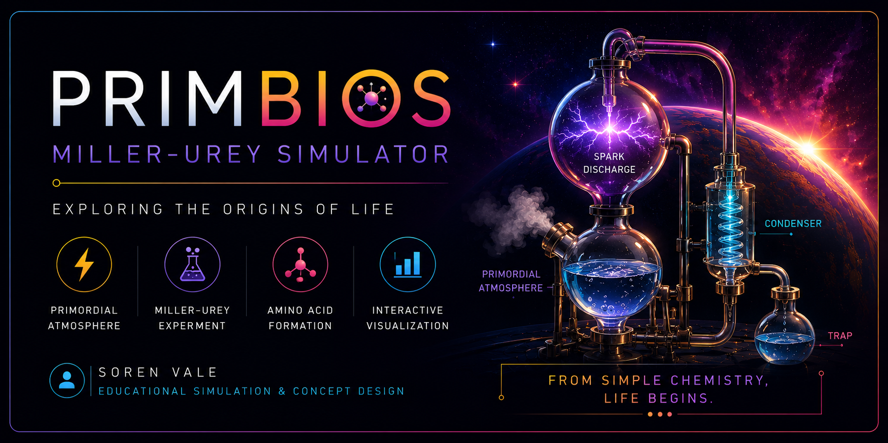

  

# ⚡ Prim-BioVolt

### 🧪 Miller–Urey Simulator

Interactive scientific visualization of the **Miller–Urey Experiment (1953)**, demonstrating the prebiotic synthesis of amino acids under simulated early Earth conditions.

---

## 📖 Overview

**Prim-BioVolt** is an open-source educational simulation of the historic **Miller–Urey Experiment**. Built with HTML5 Canvas, it recreates the experimental apparatus and chemical processes that demonstrated how organic molecules could arise from simple inorganic gases on primordial Earth.

---

## ✨ Features

- Interactive Miller–Urey apparatus
- Electric spark discharge simulation
- Animated boiling, condensation, and circulation
- Real-time experiment controls
- Amino acid detection and visualization
- Responsive, browser-based interface
- Classroom-ready educational tool

---

## 🧬 Simulation Includes

- Primordial ocean (boiling flask)
- Spark discharge chamber
- Condenser
- Organic compound trap
- Early Earth atmosphere (H₂O, CH₄, NH₃ & H₂)
- Amino acid formation
- Seven-day experimental progression

---

## 🎓 Built For

- Class XII Biology
- Origin of Life
- Molecular Biology
- Biochemistry
- Interactive Science Education

---

## 🛠️ Technologies

- HTML5
- CSS3
- JavaScript (ES6)
- HTML5 Canvas API

---

## 📜 License

Licensed under the **GNU General Public License v3.0 (GPL-3.0)**.

---

## 👨‍🏫 Author

**Draven Ashcroft**

**M.Sc. Agricultural Entomology**  
**ASRB–NET Qualified**  
**DIPS Chain of Institutions, Tanda**

---

## 🙏 Acknowledgements

Special thanks to the AI tools that accelerated development:

- **OpenAI (ChatGPT)** — scientific review, debugging, and implementation
- **Anthropic Claude** — core implementation and optimization
- **Google Gemini** — concept exploration
- **Moonshot AI** — debugging and refinement
- **DeepSeek** — early drafts and experimentation

---

## ⚡ Prim-BioVolt

### *Where Lightning Sparked the Chemistry of Life.*

